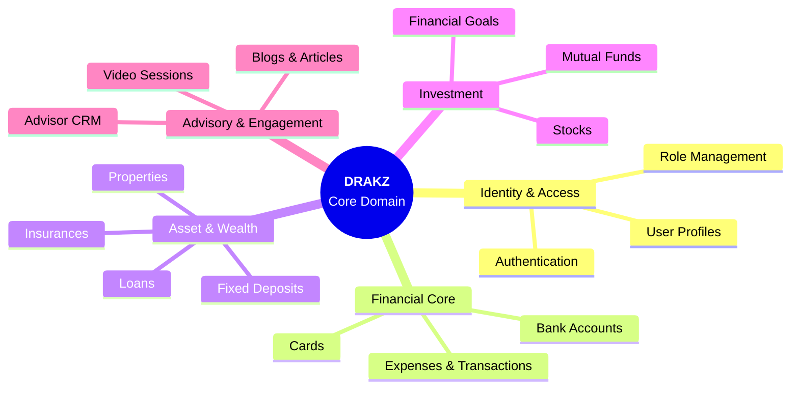
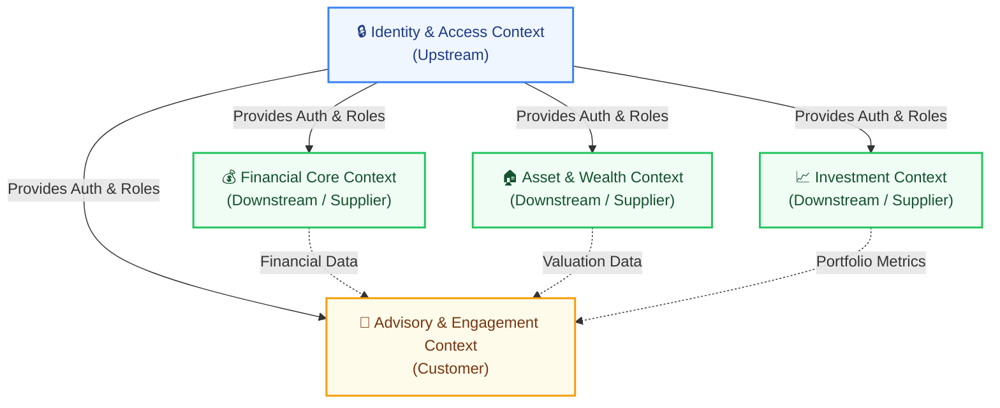

  
# 📘 Domain-Driven Design (DDD) Architecture Report
**Project Name:** DRAKZ - Next-Generation Modular Financial Ecosystem
  

---

## 1. Project Overview

### 🏷️ Title
**DRAKZ: Next-Generation Modular Financial Ecosystem**

### 📝 Brief Description
DRAKZ is a comprehensive, sophisticated financial management platform designed to provide users with a centralized hub for unified personal finance, wealth management, and expert advisory services. Built upon a modular, domain-driven architecture, the ecosystem seamlessly integrates day-to-day transaction tracking with long-term asset management—covering bank accounts, expenses, stocks, mutual funds, real estate, and insurances. 

Beyond standard tracking, DRAKZ differentiates itself by incorporating an AI-driven advisory layer and a dedicated Advisor Hub. Users interact with an intelligent financial chatbot for automated, actionable insights based on their spending and investment behaviors. Concurrently, the platform bridges the gap between automation and human expertise by allowing users to schedule secure video consultation sessions with certified financial advisors. Advisors have access to dedicated CRM dashboards to track client portfolios and generate detailed financial reports. With its secure role-based infrastructure serving distinct User, Advisor, and Admin modules, DRAKZ elevates traditional personal finance by prioritizing intelligent decision-making, cohesive portfolio visualization, and real-time expert collaboration.

---

## 2. Domain-Driven Design (DDD) Specifications

### A. Bounded Contexts

To maintain high cohesion and low coupling across a complex system, the DRAKZ Core Domain has been partitioned into five principal Bounded Contexts. Each context encapsulates its own ubiquitous language and business logic.

### B. Context Mappings

Integration between contexts relies primarily on a **Customer-Supplier** pattern. The Identity Context serves as the ultimate **Upstream** dependency, ensuring secure role-based access before operations in downstream contexts can proceed.

### C. Domain Architecture: Entities, Value Objects, & Services

Each Bounded Context manages its distinct components. **Entities** possess strict identities (e.g., UUIDs), while **Value Objects** are immutable and defined by their attributes.

| Bounded Context | 📌 Root & Child Entities | 🧩 Value Objects | ⚙️ Domain Services |
| :--- | :--- | :--- | :--- |
| **Identity & Access** | `Person` (Root) `User`, `Advisor`, `Admin` | `Credentials`, `ContactInfo`, `RoleType` | `AuthService` `ProfileManagementService` |
| **Financial Core** | `Transaction` (Root) `BankAccount`, `Card`, `Expense` | `Money` (Amt/Currency), `DateRange`, `Category` | `CategorizationService` `AnalyticsService` |
| **Asset & Wealth** | `Asset` (Root) `Property`, `Insurance`, `Loan` | `Valuation`, `InterestRate`, `PolicyDetails` | `AssetValuationService` `AmortizationCalculator` |
| **Investment** | `Portfolio` (Root) `Stock`, `MutualFund` | `TickerSymbol`, `RiskProfile`, `NAV` | `MarketDataService` `GoalTrackingService` |
| **Advisory Model** | `AdvisorySession` (Root) `UserAdvisorLink`, `Blog` | `VideoRoomURL`, `ConsultationSchedule` | `MatchmakingService` `ReportGenerationService` |

### D. Cardinality Ratios

The relationships defining the underlying data schema are structured as follows:

- **Inheritance / 1:1 Constraints:**
  - `Person` **`1 : 1`** (`User` | `Advisor` | `Admin`) - *Strict Sub-typing Extension*
- **Composition / 1:N Constraints:**
  - `User` **`1 : N`** `Expenses` *(A user can have multiple expenses, but an expense belongs exclusively to one user)*
  - `User` **`1 : N`** `BankAccounts` & `Cards`
  - `User` **`1 : N`** `Investments` (`Stocks` / `Mutual Funds`)
  - `User` **`1 : N`** `Assets` (`Properties` / `Insurances`)
  - `Advisor` **`1 : N`** `Blogs` *(An advisor can publish multiple articles)*
- **Aggregation / M:N Constraints (Resolved via Mapping Collections):**
  - `User` **`M : N`** `Advisor` *(Mapped through `users_advisors`. A user may consult many advisors over time, and an advisor manages multiple clients)*

### E. Domain Aggregates

Aggregates define a boundary around one or more entities to ensure transactional consistency and enforce business invariants.

#### 1. The Fin-Core Aggregate
*   **Aggregate Root:** `User`
*   **Boundaries:** `BankAccounts`, `Cards`, `Expenses`, `FinancialGoals`
*   **Invariants:** An `Expense` must rigidly link to an existing `BankAccount` or `Card`. A deletion operation on the `User` root must cascade, automatically destroying all tied financial histories to maintain data integrity.

#### 2. The Wealth Portfolio Aggregate
*   **Aggregate Root:** `Portfolio` *(Bound strictly to `User` identity)*
*   **Boundaries:** `Stocks`, `MutualFunds`, `Properties`, `Insurances`.
*   **Invariants:** The total net worth calculation must sum current valuations across all boundaries instantly. Modifying an underlying asset (e.g., updating property value) must cleanly propagate to trigger a re-valuation of the entire `Portfolio`.

#### 3. The Advisory Relationship Aggregate
*   **Aggregate Root:** `Advisor`
*   **Boundaries:** `users_advisors` *(Relationship mappings)*, Assigned Clients.
*   **Invariants:** `User` data accessible to the `Advisor` is strictly **Read-Only** from this perspective. An advisory relationship requires explicit opt-in confirmation from the `User` before the `Advisor` root can invoke operations like generating PDF financial reports.
