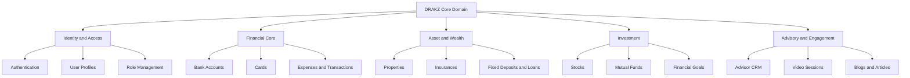
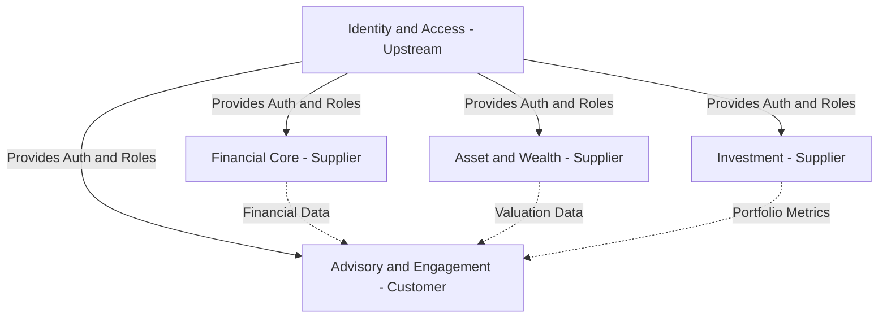

  
# Domain-Driven Design (DDD) Architecture Report
**Project Name:** DRAKZ - Next-Generation Modular Financial Ecosystem
  

---

## 1. Project Overview

### Title
**DRAKZ: Next-Generation Modular Financial Ecosystem**

### Brief Description
DRAKZ is a comprehensive, sophisticated financial management platform designed to provide users with a centralized hub for unified personal finance, wealth management, and expert advisory services. Built upon a modular, domain-driven architecture, the ecosystem seamlessly integrates day-to-day transaction tracking with long-term asset management covering bank accounts, expenses, stocks, mutual funds, real estate, and insurances. 

Beyond standard tracking, DRAKZ differentiates itself by incorporating an AI-driven advisory layer and a dedicated Advisor Hub. Users interact with an intelligent financial chatbot for automated, actionable insights based on their spending and investment behaviors. Concurrently, the platform bridges the gap between automation and human expertise by allowing users to schedule secure consultation sessions with certified financial advisors. Advisors have access to dedicated CRM dashboards to track client portfolios and generate detailed financial reports. With its secure role-based infrastructure serving distinct User, Advisor, and Admin modules, DRAKZ elevates traditional personal finance by prioritizing intelligent decision-making, cohesive portfolio visualization, and real-time expert collaboration.

---

## 2. Domain-Driven Design (DDD) Specifications

### A. Bounded Contexts

To maintain high cohesion and low coupling across a complex system, the DRAKZ Core Domain has been partitioned into five principal Bounded Contexts. Each context encapsulates its own ubiquitous language and business logic.

1. **Identity and Access Context:** Manages core authentication, role-based access control (RBAC), and profile data for generic persons. This context enforces system-wide security constraints.
2. **Financial Core Context:** Handles high-volume, day-to-day financial operations. It is bounded strictly to tracking operational cash flow rather than long-term asset valuation.
3. **Asset and Wealth Context:** Specialized in tracking illiquid and semi-liquid assets such as physical properties, life insurances, and fixed deposits.
4. **Investment Context:** Manages market-driven, volatile financial instruments. It handles real-time portfolio tracking for stocks and mutual funds against specific financial goals.
5. **Advisory and Engagement Context:** Facilitates B2B and B2C interactions, allowing certified advisors to manage authorized client portfolios, conduct video sessions, and publish financial articles.

### B. Context Mappings

Integration between contexts relies primarily on a **Customer-Supplier** pattern. The system is designed defensively where core infrastructure supplies data to engagement layers without bleeding domain logic.

*   **Upstream Identity:** The Identity Context serves as the ultimate upstream dependency. Downstream contexts rely on the Shared Kernel of a JSON Web Token (JWT) payload to identify the user and authorize domain actions.
*   **Supplier Contexts:** The Financial, Asset, and Investment contexts act as strictly isolated suppliers. They do not communicate with each other directly but store specialized data independently tied back to user identities.
*   **Customer Context:** The Advisory Context acts as a customer to the supplier contexts. When authorized via the mapping collections, the Advisory Context aggregates data from Financial, Asset, and Investment domains strictly for execution of Read operations to populate the Advisor Dashboard and generate PDF reports.

### C. Domain Architecture: Entities, Value Objects, & Services

Each Bounded Context manages its distinct components. **Entities** possess strict identities (e.g., MongoDB unique identifiers), indicating they undergo structural state changes over time. **Value Objects** are immutable, defined purely by their attributes rather than a unique identifier. **Domain Services** encapsulate business operations that do not naturally fit within an Entity.

| Bounded Context | Root & Child Entities | Value Objects | Domain Services |
| :--- | :--- | :--- | :--- |
| **Identity & Access** | `Person` (Root) `User`, `Advisor`, `Admin` | `Credentials` (Cryptographic Hash) `ContactInfo` (Email, Phone) `RoleType` (Enum) | `AuthenticationService` `ProfileManagementService` |
| **Financial Core** | `Transaction` (Root) `BankAccount`, `Card`, `Expense` | `Money` (Amount, Currency Code) `DateRange` `CategoryType` | `CategorizationService` `FinancialAnalyticsService` |
| **Asset & Wealth** | `Asset` (Root) `Property`, `Insurance`, `Loan` | `ValuationAmount` `InterestRate` `PolicyDetails` | `AssetValuationService` `AmortizationCalculator` |
| **Investment** | `Portfolio` (Root) `Stock`, `MutualFund`, `Goal` | `TickerSymbol` `RiskProfile` `NetAssetValue` | `MarketDataService` `GoalTrackingService` |
| **Advisory Model** | `AdvisorySession` (Root) `UserAdvisorLink` `Blog` | `VideoRoomURL` `ConsultationSchedule` | `MatchmakingService` `ReportGenerationService` |

### D. Cardinality Ratios

The relationships defining the underlying schema dictate how context mappings are persisted physically within the document database. 

*   **Inheritance / 1:1 Constraints:**
    *   `Person` **`1 : 1`** (`User` | `Advisor` | `Admin`): Implements strict sub-typing extension. A generalized persona is extended exclusively into one operational role per account.
*   **Composition / 1:N Constraints:**
    *   `User` **`1 : N`** `Expenses`: A user can have multiple expenses, but an expense belongs exclusively to one user lifecycle.
    *   `User` **`1 : N`** `BankAccounts` & `Cards`: A user manages multiple instances of internal tracking accounts.
    *   `User` **`1 : N`** `Investments`: A user owns multiple volatile assets spanning stocks and mutual funds.
    *   `User` **`1 : N`** `Assets`: A user owns multiple static assets encompassing property and insurance portfolios.
    *   `Advisor` **`1 : N`** `Blogs`: An advisor maintains an exclusive authorship over published articles.
*   **Aggregation / M:N Constraints:**
    *   `User` **`M : N`** `Advisor`: Facilitated through intermediate mapping collections, allowing a single user to engage multiple specialist advisors simultaneously while an advisor concurrently manages a broader client pool.

### E. Domain Aggregates

Aggregates define a strong boundary around one or more entities to ensure transactional consistency and enforce strict business invariants (rules). Dependent entity data mutations must occur explicitly through the Aggregate Root.

**1. The User Fin-Core Aggregate**
*   **Aggregate Root:** `User`
*   **Boundaries:** `BankAccounts`, `Cards`, `Expenses`, `FinancialGoals`
*   **Invariants:** An `Expense` entity must rigidly link to an existing `BankAccount` or `Card` entity within the same user boundary. If the `User` root is deleted from the Identity Context, all boundaries within the Fin-Core aggregate must instantly undergo cascade-deletion to avoid orphaned transactional data.

**2. The Wealth Portfolio Aggregate**
*   **Aggregate Root:** `Portfolio` (Bound strictly to the `User` profile)
*   **Boundaries:** `Stocks`, `MutualFunds`, `Properties`, `Insurances`.
*   **Invariants:** The total net worth calculation forms an invariant that must consistently sum current valuations across all asset boundaries. Modifying an underlying asset (e.g., updating a property's market value) triggers a forced recalculation of the encompassing `Portfolio` aggregate state.

**3. The Advisory Relationship Aggregate**
*   **Aggregate Root:** `Advisor`
*   **Boundaries:** `users_advisors` (Relationship mappings), Assigned Clients.
*   **Invariants:** Core access control parameters dictate that `User` data accessible to the `Advisor` root must be treated as structurally immutable (strictly Read-Only) proxy data. Furthermore, establishing this aggregate boundary requires bi-directional consent. A user cannot be injected into the advisor's client boundary without recorded explicit approval.
